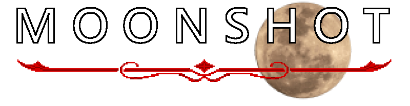
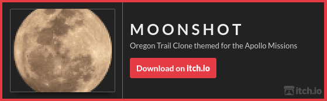

<p align="center">
  </img>
</p>

---

#### Oregon Trail Clone themed for the Apollo Missions. <a href="https://itch.io/jam/game-off-2020">Submission for Game Off 2020 - "MOONSHOT"</a>.

<a href="https://dylanlangston.itch.io/moonshot"></a>


Made possible thanks to the following:
* <a href="https://github.com/ChrisDill/Raylib-cs">Raylib-cs</a>
* <a href="https://dotnet.microsoft.com/download/dotnet-core">.NET Core</a>
* <a href="https://github.com/dylanlangston/moonshot/blob/main/attribution.md">Images and Music</a>

---

#### Getting Started

Prerequisites:
* You'll need to download and install the .NET Core 3.1 SDK.
* On linux you'll need to ensure that libgdiplus is installed.
</br>
</br>
To get started clone the repository. Then run the following commands in the downloaded directory.

```bash
dotnet restore
dotnet run
```
